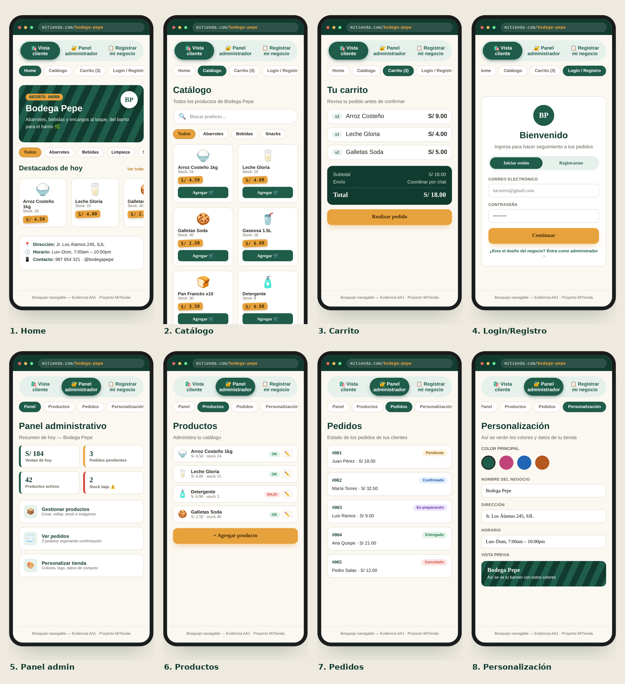

# 🛒 MiTienda

**MiTienda** es una aplicación web tipo *marketplace* pensada para dar soporte a micro y pequeños emprendimientos (minimarkets, bodegas de barrio, negocios personales, etc.), permitiéndoles crear su propia tienda en línea y gestionar productos, pedidos e inventario desde un panel administrativo.

Proyecto desarrollado para la Unidad Didáctica **Desarrollo y soporte de aplicaciones multiplataforma** — Actividad de Aprendizaje 1 (AA1): *"Mi emprendimiento online"*.

---

## 📌 Descripción

Ante la necesidad de que pequeños negocios encuentren canales de venta alternativos, MiTienda funciona como una plataforma **multi-tienda**: cada negocio puede registrarse, obtener su propio espacio dentro del marketplace y ofrecer sus productos a sus clientes a través de una tienda en línea con carrito de compras, gestión de pedidos y panel de administración propio.

## ✨ Funcionalidades principales

### Lado cliente
- 🏠 Página de inicio (marketplace) con navegación a las tiendas
- 🛍️ Catálogo de productos por categoría (abarrotes, bebidas, snacks, limpieza, etc.)
- 🛒 Carrito de compras
- 📦 Seguimiento de pedidos
- 🏪 Registro y creación de tienda propia (nuevo emprendimiento)
- 🔑 Recuperación de contraseña
- ✉️ Formulario de contacto

### Panel administrativo (por negocio)
- 🔐 Login de administrador
- 📊 Dashboard / resumen general
- 📦 Gestión de inventario
- 🛒 Gestión de productos
- 📋 Gestión de pedidos
- 💰 Registro de ventas
- 👥 Gestión de usuarios
- ⚙️ Configuración del negocio

## 🎨 Identidad visual

Paleta de colores definida para la tienda de ejemplo **Bodega Pepe**, pensada para transmitir identidad local (bodegas/minimarkets de barrio) y mantener buen contraste en las vistas de cliente y administrador:

| Color | Código | Uso |
|---|---|---|
| 🟩 Verde toldo | `#1F5C4A` | Header, navbar, banner del negocio, botones principales, chips activos |
| 🟧 Mostaza | `#E8973E` | Botones de acción (Agregar, Realizar pedido, Continuar), precios, badges de estado |

**¿Por qué estos colores?**
- **Verde toldo** evoca los toldos de lona típicos de las bodegas de barrio en Perú, dando identidad local inmediata.
- **Mostaza** funciona como acento cálido para llamadas a la acción y precios, de modo que el ojo del cliente los ubique rápido en el catálogo.
- La combinación verde oscuro + mostaza + fondo crema mantiene buen contraste (AA) para texto y botones, y se aplica de forma consistente en las 8 pantallas del bosquejo (vista cliente y vista administrador), cumpliendo el requisito de "mismo estilo visual".

## 📱 Bosquejo navegable (capturas)



Vistas del bosquejo navegable — Evidencia AA1:

1. **Home** — landing del negocio (Bodega Pepe) con destacados y datos de contacto
2. **Catálogo** — productos filtrables por categoría
3. **Carrito** — resumen de pedido con subtotal y total
4. **Login/Registro** — acceso de cliente y acceso como administrador
5. **Panel admin** — resumen de ventas, pedidos y stock
6. **Productos** (admin) — administración del catálogo
7. **Pedidos** (admin) — estado de pedidos de los clientes
8. **Personalización** (admin) — configuración de colores, nombre, dirección y horario de la tienda

## 🧱 Arquitectura y tecnologías

| Capa | Tecnología |
|---|---|
| **Presentación** | HTML5, CSS3 (estilos propios, sin frameworks CSS) |
| **Lógica de cliente** | JavaScript (ES Modules) |
| **Backend / Base de datos** | Firebase (Firestore como base de datos NoSQL) |
| **Autenticación** | Firebase Authentication (correo/contraseña y acceso anónimo) |
| **Almacenamiento de archivos** | Firebase Storage |
| **Despliegue** | Firebase Hosting (dejado listo para publicar la app en producción) |

El proyecto sigue una arquitectura de n-capas apoyada en **Firebase como Backend-as-a-Service (BaaS)**: el cliente (HTML/CSS/JS) se comunica directamente con los servicios de Firebase (Firestore, Auth, Storage) sin necesidad de un servidor propio intermedio.

> ☁️ **Cloud Computing:** toda la base de datos, autenticación y almacenamiento de archivos corren en la nube (Google Cloud, a través de Firebase). El proyecto ya está configurado y listo para publicarse en Firebase Hosting; la parte de pipelines, contenedores (Docker) y despliegue automatizado corresponde a etapas posteriores (AA2 en adelante).

## 📋 Gestión del proyecto (Azure DevOps)

El desarrollo se planificó y gestionó en **Azure DevOps** (proyecto *"Mi tienda dev"*), con un equipo de 4 integrantes y trabajo organizado por tableros e historias de usuario:

- **56 work items creados** / 38 activos durante el Sprint 1.
- **Features del backlog:**
  - *Diseño y estilo visual* — paleta de colores, tipografía, logo, wireframes de las vistas principales.
  - *Base de datos en la nube* — creación del proyecto en Firebase, activación de Firestore, definición de colecciones, carga de datos de prueba y conexión con el frontend.
  - *Desarrollo Frontend* — repositorio, Home, catálogo, carrito, login/registro, panel administrativo y publicación en Firebase Hosting.
  - *Documentación de la evidencia* — propuesta de nuevas tendencias, referencias bibliográficas y consolidación del informe final.
  - *Presentación y exposición* — diapositivas, ensayo y preparación de respuestas.
- **Integración con GitHub:** el proyecto está conectado al repositorio [`paulmussen14-ui/mitienda`](https://github.com/paulmussen14-ui/mitienda) mediante una GitHub App, dando trazabilidad entre tareas de Azure Boards y commits del código.

Esta gestión respalda la competencia de colaboración en equipo (EC2) evaluada en la rúbrica de la AA1, más allá de la parte puramente técnica.

## 🗂️ Estructura del proyecto

```
mitienda/
├── index.html                 # Página principal (marketplace)
├── pages/                     # Páginas del cliente
│   ├── carrito.html
│   ├── contacto.html
│   ├── pedidos.html
│   ├── productos.html
│   ├── recuperar.html
│   ├── registro.html
│   └── admin/                 # Panel administrativo
│       ├── login.html
│       ├── index.html
│       ├── productos.html
│       ├── inventario.html
│       ├── pedidos.html
│       ├── ventas.html
│       ├── usuarios.html
│       └── configuracion.html
├── css/                        # Estilos por sección
├── js/                         # Lógica de la aplicación
│   ├── firebase.js             # Configuración de Firebase
│   ├── auth.js / auth-cliente.js
│   ├── negocios.js             # Manejo de tienda/negocio actual
│   ├── productos.js / carrito.js / pedidos.js / ventas.js
│   └── admin-*.js              # Lógica del panel administrativo
├── assets/
│   ├── icons/                  # Íconos y favicon
│   └── img/                    # Logo y capturas del bosquejo
└── package.json
```

## 🗃️ Modelo de datos (Firestore)

Colecciones activas en la base de datos del proyecto (`mitienda`):

| Colección | Descripción |
|---|---|
| **negocios** | Datos de cada tienda/emprendimiento registrado |
| **usuarios** | Clientes y administradores |
| **productos** | Catálogo por negocio, con categoría |
| **pedidos** | Órdenes generadas desde el carrito |
| **carritos** | Carrito activo por cliente antes de confirmar el pedido |
| **ventas** | Registro de transacciones concretadas |
| **movimientos_inventario** | Historial de entradas/salidas de stock |
| **clientes** | Datos específicos de clientes registrados |

**Ejemplo de atributos — colección `productos`:**

```
productos/{productoId}
├── nombre: string        // "Arroz Costeño 1kg"
├── descripcion: string   // "Arroz extra de 1 kg"
├── categoria: string
├── precio: number        // 4.5
├── stock: number         // 29
├── imagen: string (URL)
└── negocio_id: string    // referencia al negocio dueño del producto
```

Cada documento de `productos` está relacionado a su negocio mediante `negocio_id`, lo que permite que el marketplace filtre el catálogo por tienda.

## 🔐 Autenticación

Implementada con **Firebase Authentication**, soportando:
- Acceso **anónimo** (para navegación de invitados en el marketplace).
- Acceso por **correo y contraseña** (clientes y administradores registrados).

## 🚀 Nuevas tendencias propuestas

Como parte de la propuesta de mejora del proyecto se plantean dos tendencias tecnológicas (simulación, no implementadas aún en esta etapa):

1. **Recomendaciones personalizadas basadas en analítica de compras (IA)** — sugerencia de productos según el historial del cliente, para potenciar la fidelización dentro del marketplace.
2. **PWA (Progressive Web App)** — permitiría instalar MiTienda como app en el celular del cliente, con acceso más rápido y soporte offline parcial al catálogo, mejorando la experiencia de compra en zonas con conexión inestable.

## 📚 Referencias bibliográficas

- Google. (s. f.). *Modelo de datos de Cloud Firestore*. Firebase Documentation. https://firebase.google.com/docs/firestore/data-model?hl=es-419
- Google. (s. f.). *Firebase Authentication*. Firebase Documentation. https://firebase.google.com/docs/auth
- Google. (s. f.). *Comienza con Firebase Hosting*. Firebase Documentation. https://firebase.google.com/docs/hosting/quickstart?hl=es-419
- Mozilla. (s. f.). *Aplicaciones web progresivas (PWA)*. MDN Web Docs. https://developer.mozilla.org/es/docs/Web/Progressive_web_apps
- IBM. (2025). *Tipos de arquitecturas de desarrollo de aplicaciones*. IBM Think. https://www.ibm.com/mx-es/think/topics/application-architecture-types

## 👥 Autores

- Jean Paul Moncada
- Ana huaman Evagenlista
- Guillermo Jharnelt Paucar Ortiz

Proyecto grupal — Actividad de Aprendizaje 1 (AA1)
